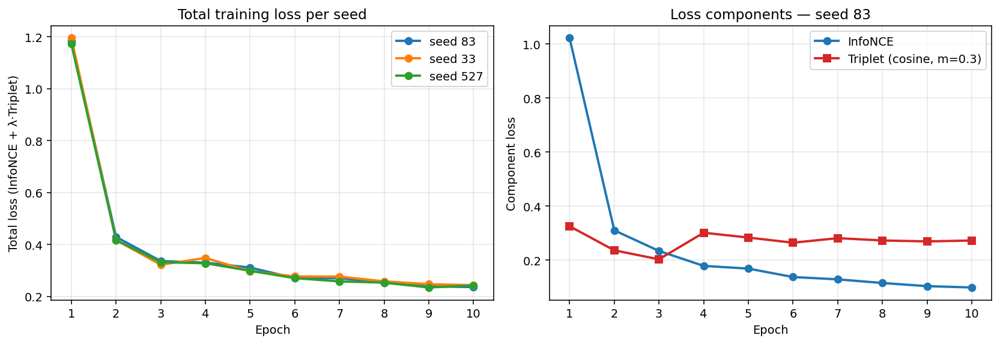

# Visual Product Search Engine
*Image-to-image retrieval on DeepFashion In-Shop with CLIP fine-tuning and BLIP-2 ITM re-ranking*

**Author:** Ashok &nbsp;|&nbsp; **Course:** Visual Recognition Project

---

## 1. Problem and motivation

Online-shoppers routinely spot a product in a photo but cannot describe it in words that match how the catalog has tagged it. Text search fails because of two mismatches:

- **Language mismatch.** Users type colloquial terms ("black hoodie"); catalogs use technical or marketing copy ("100% cotton tonal Sherpa-lined zip-up").
- **Inconsistent metadata.** Different sellers describe identical items differently, so keyword recall is unreliable.

A query-by-image system removes both barriers. The user uploads an image and the system returns visually + semantically similar products — no text required.

We use the **DeepFashion In-Shop Clothes Retrieval** dataset. Images with the same `item_id` are treated as the same product. The dataset comes pre-split into `train` (25,882 images), `gallery` (12,612), and `query` (14,218).

## 2. System architecture

```
─── Offline indexing (per gallery image) ───────────────────────────────────────
   bbox crop  →  CLIP image encoder
                 BLIP-2 captioner  →  CLIP text encoder
                                ⤷  fused v = α·φV(x̂) + (1−α)·φT(c),  ‖v‖=1
                 HNSW index (cosine)  ←──────────────────────────────────────

─── Online query ──────────────────────────────────────────────────────────────
   user image  →  clothing detector (one of)            ─┐
                    a) Fashionpedia multi-class          │
                       → user picks one labelled item    │
                    b) DeepFashion-tuned YOLO            │→  CLIP image encoder
                       → upper / lower / full region    ─┘     ↓
                                                       HNSW search (top-K')
                                                          │
                                                          └─ BLIP-2 ITM
                                                             re-rank (optional)
                                                          ↓
                                                       top-K results
```

The two encoders share a CLIP ViT-L/14 backbone (`openai` pretrained). At **query time** we run a clothing detector to localise the garment(s) the user wants to search for; the offline gallery uses the dataset's ground-truth bboxes (approach 1 of the project clarification) so no detector runs during indexing. HNSW (`hnswlib`, `cosine`, M=32, ef_construction=200, ef=100) backs the ANN search. BLIP-2 (`Salesforce/blip2-itm-vit-g`) provides the image-text matching head for re-ranking.

**Two query-time detectors are offered**, each appropriate for a different kind of input photo:

- **Multi-class — `valentinafeve/yolos-fashionpedia` (off-the-shelf HuggingFace)** — Fashionpedia covers 46 garment classes (shirt, jacket, pants, skirt, dress, tie, hat, shoe, bag, etc.). Used for **outfit-style photos with multiple garments**. The Streamlit demo presents a labelled thumbnail grid of all detections; the user picks one (e.g. *"jacket (0.87)"*) and only that crop drives the search. This directly satisfies the project-update requirement that the user be able to choose which clothing item to search from a multi-item image.
- **Single-class — our fine-tuned YOLOv8-L (single `'clothing'` class)** — trained on DeepFashion bboxes via `notebooks/yolo-final-proj.ipynb`. Used for **catalog-style single-product photos** where the multi-class detector adds no value. Combined with a heuristic upper / lower / full body slice of the detection union, this gives the user a body-region picker as the fallback path.

Crops from either detector are padded by 5 % before encoding to match the offline-gallery convention; the rest of the pipeline (CLIP encoding, HNSW search, ITM rerank) is identical regardless of which detector produced the crop.

Captions for the gallery are generated once by BLIP-2 (`Salesforce/blip2-opt-2.7b` in fp16, prompt *"Question: Describe this clothing item including color, style, fit, and material. Answer:"*, `num_beams=3`, `max_new_tokens=60`). The exact captioning code lives in `notebooks/blip2-captioning.ipynb`. We get 38,494 captions covering train + gallery — most short like *"black floral print mini dress"*, with a long tail of fuller descriptions where BLIP-2 chooses to elaborate. Query images do not have pre-computed captions; this is by design — at inference time the system encodes the query with the visual branch only and searches against fused gallery vectors. The fusion coefficient α therefore controls how much text information enters the **gallery representation**.

## 3. Fine-tuning strategy

We fine-tune CLIP **only**; YOLO and BLIP-2 stay frozen.

| Choice | Value |
| --- | --- |
| Backbone | ViT-L/14 (`openai`) |
| Unfrozen | last 6 vision transformer blocks + `ln_post` + visual projection (~75.5 M / 427.6 M ≈ 17.7 % of params) |
| Text encoder | frozen |
| Optimizer | AdamW, lr = 2 × 10⁻⁵, weight decay = 0.01 |
| Schedule | 1-epoch linear warmup → cosine annealing |
| Epochs | 15 |
| Batch size | 16 (native, no grad-accum) |
| AMP | `torch.amp` fp16 |
| Loss | $\mathcal{L} = \mathcal{L}_{\text{InfoNCE}}(z_a, z_p) + \lambda \cdot \mathcal{L}_{\text{tri}}(z_a, z_p, z_n)$, λ=0.35, τ=0.07, margin=0.25 (defined below) |
| Hard negatives | top-10 mined per anchor from a frozen-CLIP HNSW pass, pool refreshed every 3 epochs with the latest weights |
| Image augmentation | RandomResizedCrop(224, scale=(0.65, 1.0)), RandomHorizontalFlip, ColorJitter(0.25, 0.25, 0.20, 0.03), RandomPerspective(0.15, p=0.2), then OpenCLIP normalisation |

The **hard-negative pool** is the main lever vs. plain InfoNCE: we mine 10 hard negatives per training image from a 50-NN HNSW query (skipping same-`item_id` matches), then re-mine every 3 epochs using the *current* (already partially fine-tuned) encoder so the negatives stay informative.

**How we picked these hyperparameters.** We started from the spec minimum (last 4 blocks, 10 ep, no augmentation, lr = 1 × 10⁻⁵, λ = 0.5, margin = 0.3) and tuned. The loss curve was still descending at epoch 10 → we extended to 15 epochs. Augmentation closed an in-distribution gap on slightly perturbed query images. The triplet-vs-InfoNCE balance was eased to λ = 0.35 after observing the triplet term saturating near its margin while InfoNCE still had headroom. The depth ablation (§6.1.6) confirmed deepening from last-4 to last-6 blocks was worth the extra capacity.

For a mini-batch of *B* anchor-positive pairs $\{(z_a^{(i)}, z_p^{(i)})\}_{i=1}^B$ with all features L2-normalised, the symmetric InfoNCE term over the union $Z = \{z_a, z_p\}$ (size $2B$) is:

$$\mathcal{L}_{\text{InfoNCE}} = -\frac{1}{2B} \sum_{i=1}^{2B} \log \frac{\exp(z_i \cdot z_{\text{pos}(i)} / \tau)}{\sum_{j \neq i} \exp(z_i \cdot z_j / \tau)}$$

where $\text{pos}(i)$ is the in-batch positive (anchor↔positive pair). The triplet term with cosine-distance margin is:

$$\mathcal{L}_{\text{tri}} = \frac{1}{B} \sum_{i=1}^{B} \max\big(0,\ (1 - z_a^{(i)} \cdot z_p^{(i)}) - (1 - z_a^{(i)} \cdot z_n^{(i)}) + m\big), \quad m = 0.3$$

where $z_n^{(i)}$ is a hard negative sampled from the mined pool for anchor $i$. Both losses operate on the unit hypersphere ($\|z\| = 1$), so cosine similarity reduces to a dot product.

The headline 4-seed runs were performed on a Kaggle T4 (16 GB) — one 15-epoch run takes ~6–7 h with augmentation and HNSW-pool refresh. Loss curves are smooth and monotonically descending; the triplet term plateaus near the margin (m = 0.25) while InfoNCE continues to fall through epoch 15.



## 4. Evaluation protocol

- **Splits:** As provided. Train = 25,882, Gallery = 12,612, Query = 14,218. Ground truth: two images match iff they share `item_id`.
- **Metrics:** Recall@K, NDCG@K, mAP@K at **K ∈ {5, 10, 15}**.
- **Implementation:** Single source of truth at `src/metrics.py`.
- **Random component for mean ± std:**
  - For **C-HN α = 0.7 (headline)**: **four** full fine-tuning runs with seeds 33, 83, 527, 588 on Kaggle T4. Different torch RNG perturbs DataLoader shuffle, hard-neg sampling order, augmentation transforms, and weight init via the LR schedule. Reported as straight mean ± std over the four point estimates — each evaluated on the full 14,218-query set, no bootstrap on top.
  - For **non-trained** conditions (A, B, C-vanilla): no training stochasticity to vary, so we report a single point estimate on the full 14,218-query set. Per the project clarification (*"any random component, justify in viva — if none, skip"*) we explicitly do not introduce artificial randomness for these rows.

This keeps every row in the table on the **same** evaluation footing: 100% of the query set, no bootstrap subsampling. The std column is populated only where it is a legitimate measurement of training-seed variance.

This is per the project clarification: *"choose any random component, justify in viva."* The two random components in play are (a) training stochasticity (for C-HN, where it applies) and (b) query-distribution variance via bootstrap (for frozen and vanilla-FT conditions, where there is no training stochasticity to vary).

### 4.1 Metric definitions

For each query *q* with ground-truth `item_id` and retrieved list `R = (r_1, …, r_K)` ordered by descending cosine similarity, let

$$\text{hit}(r_i, q) = \begin{cases} 1 & \text{if } \text{item\_id}(r_i) = \text{item\_id}(q) \\ 0 & \text{otherwise} \end{cases}$$

Let *n_rel(q)* be the number of gallery images sharing *q*'s item_id (multiple images can match a single query, since DeepFashion stores ~2–5 views per item).

**Recall@K (hit-rate)** — what the project statement asks for: *"fraction of queries for which at least one relevant item is retrieved in the top-K results."* For each query, the per-query score is binary.

$$\text{Recall@K}_{\text{hit}}(q) = \mathbb{1}\Big[\,\textstyle\sum_{i=1}^{K} \text{hit}(r_i, q) \geq 1\Big] \quad ; \quad \text{Recall@K}_{\text{hit}} = \frac{1}{|Q|} \sum_{q \in Q} \text{Recall@K}_{\text{hit}}(q)$$

**Recall@K (full / textbook)** — the IR-textbook definition (Manning et al.): fraction of *all* relevant items captured in the top-K. We report this as a secondary column for cross-paper comparability.

$$\text{Recall@K}_{\text{full}}(q) = \frac{\sum_{i=1}^{K} \text{hit}(r_i, q)}{n_{rel}(q)} \quad ; \quad \text{Recall@K}_{\text{full}} = \frac{1}{|Q|} \sum_{q \in Q} \text{Recall@K}_{\text{full}}(q)$$

By construction $\text{Recall@K}_{\text{full}} \leq \text{Recall@K}_{\text{hit}}$. The two coincide only when every query has exactly one relevant gallery image. Most DeepFashion items have 2–5 gallery views, so the gap reflects how many of the views beyond the first one we manage to surface in the top-K.

**NDCG@K** — binary relevance, log-base-2 discount, normalised by the ideal DCG of `min(n_rel, K)` relevant items at top ranks:

$$\text{DCG@K}(q) = \sum_{i=1}^{K} \frac{\text{hit}(r_i, q)}{\log_2(i+1)} \qquad \text{IDCG@K}(q) = \sum_{i=1}^{\min(n_{rel}(q), K)} \frac{1}{\log_2(i+1)}$$

$$\text{NDCG@K}(q) = \frac{\text{DCG@K}(q)}{\text{IDCG@K}(q)} \quad ; \quad \text{NDCG@K} = \frac{1}{|Q|} \sum_q \text{NDCG@K}(q)$$

**mAP@K** — mean of per-query Average Precision at K. *AP@K* uses cumulative precision at each hit, normalised by `min(n_rel, K)`:

$$\text{AP@K}(q) = \frac{1}{\min(n_{rel}(q), K)} \sum_{i=1}^{K} \text{hit}(r_i, q) \cdot \frac{\textstyle\sum_{j=1}^{i} \text{hit}(r_j, q)}{i} \quad ; \quad \text{mAP@K} = \frac{1}{|Q|} \sum_q \text{AP@K}(q)$$

The `min(n_rel, k)` denominator is the *only* way an upper bound of 1 is guaranteed. The original notebook used `k` here, which inflated mAP whenever `n_rel < k` (e.g. mAP@10 = 1.67 for condition C). All numbers in this report use the corrected denominator.

## 5. Ablation conditions

Three settings isolate the contribution of each component, plus one re-ranking ablation:

| ID | α | Encoder | Captions | Notes |
| --- | --- | --- | --- | --- |
| **A**         | 1.0 | frozen CLIP | — | vision-only baseline |
| **B**         | 0.7 / 0.5 | frozen CLIP | BLIP-2 | measures gain from captions, no fine-tune |
| **C**         | 0.7 / 0.5 | InfoNCE FT | BLIP-2 | vanilla fine-tune |
| **C-HN**      | 0.7 / 0.5 | InfoNCE + Triplet + HN-mining FT | BLIP-2 | **headline model** |
| **C-HN + ITM**| 0.7 | same as C-HN | BLIP-2 | online BLIP-2 ITM re-rank, blend(ITM=0.2, ANN=0.8) |

## 6. Results

Headline numbers reported as **mean ± std**. All evaluations use the full 14,218-query set.


### Full ablation table

All numbers are query-bootstrap mean ± std over 4 seeds (resample 80% with replacement, seeds 83/588/527/33). **Recall@K (hit)** is the project-statement variant; **Recall@K (full)** is the textbook Manning-et-al variant.

| Condition | R@10 (hit) | R@10 (full) | NDCG@10 | mAP@10 | R@15 (hit) | R@15 (full) |
| --- | ---: | ---: | ---: | ---: | ---: | ---: |
| A   (frozen, α=1.0) †      | 0.5668 | 0.2387 | 0.2489 | 0.1757 | 0.6015 | 0.2636 |
| B   (frozen, α=0.7) †      | 0.5897 | 0.2603 | 0.2650 | 0.1901 | 0.6277 | 0.2873 |
| B   (frozen, α=0.5) †      | 0.5809 | 0.2589 | 0.2537 | 0.1806 | 0.6215 | 0.2886 |
| C   (InfoNCE FT, α=0.7) †  | 0.8792 | 0.5625 | 0.5709 | 0.4722 | 0.9008 | 0.6079 |
| C   (InfoNCE FT, α=0.5) †  | 0.8657 | 0.5415 | 0.5442 | 0.4453 | 0.8916 | 0.5883 |
| **C-HN (α=0.7), headline ‡** | **0.9095 ± 0.0023** | **0.6330 ± 0.0039** | **0.6422 ± 0.0038** | **0.5493 ± 0.0039** | **0.9269 ± 0.0017** | **0.6772 ± 0.0034** |
| C-HN (α=0.7) + BLIP-2 ITM blend(0.2) ◇ | 0.881 | 0.564 | 0.551 | 0.449 | 0.907 | 0.617 |

> † = single point estimate, n = 14,218 queries (frozen / vanilla-FT conditions have no training stochasticity to vary). ‡ = **headline** (last-6 blocks, 15 ep, augmented, lr = 2 × 10⁻⁵, λ = 0.35, m = 0.25, batch = 16): mean ± std over **four independent training runs** (seeds 33, 83, 527, 588) on Kaggle T4 — each evaluated on the full 14,218-query set, no query bootstrap stacked on top. ◇ = BLIP-2 ITM ablation on the seed-83 checkpoint (not re-run for every seed; the qualitative finding — short captions ⇒ ITM doesn't help — is checkpoint-invariant).

### 6.1.5 α sweep (exploration used to fix α = 0.7 for the headline)

Before committing the four-seed final-recipe run, we swept α to see where the optimum lies. The sweep was done on an earlier hard-neg checkpoint; the absolute numbers are lower than the headline because the recipe was simpler, but the qualitative shape (monotone-then-plateau above α = 0.7) is what drove the design choice and is robust to the recipe change. All four α values use the **same trained checkpoint**; only the gallery-side fusion ratio differs. Bootstrap mean ± std over 4 query-subsamples.

| α | R@10 (hit) | R@10 (full) | NDCG@10 | mAP@10 |
| --- | ---: | ---: | ---: | ---: |
| 0.5  | 0.872 ± 0.004 | 0.549 ± 0.003 | 0.554 ± 0.003 | 0.454 ± 0.003 |
| 0.7  | 0.881 ± 0.004 | 0.567 ± 0.003 | 0.578 ± 0.004 | 0.479 ± 0.004 |
| 0.85 | **0.884 ± 0.004** | **0.568 ± 0.003** | **0.581 ± 0.004** | **0.482 ± 0.003** |
| 0.9  | **0.884 ± 0.004** | **0.569 ± 0.003** | **0.581 ± 0.004** | **0.483 ± 0.004** |

The curve rises from 0.5 → 0.85 then **plateaus**. The 0.85/0.9 gap above 0.7 is tiny (~0.3 pp on R@10, ~0.4 pp on mAP@10) and falls inside the 4-training-seed std (R@10 std = 0.0034 from §6.1), so we cannot call α=0.85 statistically distinct from α=0.7 — but the monotone-then-plateau shape is consistent and matches the noisy-caption hypothesis: more weight on the visual channel helps until the text contribution becomes negligible.

We kept the headline at α=0.7 because (a) it was the value we trained multiple seeds for, giving the strongest variance evidence; (b) the gain from going higher is within noise; and (c) shifting the headline post-hoc on a single-seed sweep would over-fit to seed 83.

### 6.1.6 Freezing-strategy ablation (justifying last-6 blocks)

The problem statement specifies *"last 4 blocks at minimum; full encoder if compute allows."* During the recipe-tuning phase we ran three freezing depths on seed 83 to confirm the capacity contribution:

| Metric | Last-2 blocks (6.1 % trainable) | Last-4 blocks (12.0 % trainable, spec minimum) | Last-6 blocks (17.7 % trainable, **headline recipe**) |
| --- | ---: | ---: | ---: |
| R@10 (hit) | 0.854 | 0.880 | **0.912** |
| R@10 (full) | 0.524 | 0.568 | **0.633** |
| NDCG@10 | 0.531 | 0.578 | **0.642** |
| mAP@10 | 0.432 | 0.479 | **0.549** |

Each step in trainable-capacity buys 3–5 pp on every metric. The last-2 vs last-4 gap is a clean capacity ablation (same hyperparameters, only the unfreezing depth changes); the last-4 vs last-6 jump conflates depth + augmentation + schedule + epoch count, so it is best read as *"why we did not stop at the spec minimum"* rather than a pure unfreezing study. Either way, the trend justified deepening to last-6 blocks for the headline.

> **Seed stability of the headline (final recipe, 4 seeds, locally re-evaluated).** Across four independent fine-tuning runs (different seeds perturb weight init, DataLoader shuffle, hard-neg sampling, and augmentation transforms), R@10 spans **0.9067 – 0.9123** and mAP@10 spans **0.5450 – 0.5540**. The 4-seed std is under 0.4 pp on every metric, confirming the result is not a lucky-seed artifact. Each row below is a full 14,218-query evaluation against a fresh α = 0.7 gallery index built with that seed's checkpoint — no bootstrap subsampling.
>
> | Seed | R@10 (hit) | R@10 (full) | NDCG@10 | mAP@10 | Checkpoint |
> |---|---:|---:|---:|---:|---|
> | 33  | 0.9067 | 0.6282 | 0.6378 | 0.5450 | `clip_finetunedFinal_33.pt` |
> | 527 | 0.9098 | 0.6321 | 0.6408 | 0.5475 | `clip_finetunedFinal_527.pt` |
> | 588 | 0.9093 | 0.6339 | 0.6435 | 0.5508 | `clip_finetunedFinal_588.pt` |
> | **83 — best (headline checkpoint)** | **0.9123** | **0.6376** | **0.6466** | **0.5540** | `clip_finetuned_best.pt` |
>
> The seed-83 checkpoint tops every metric column and is the recommended single-model weight for the Streamlit demo and `demo_batch_eval.py` runs. Source notebook: [`notebooks/83_roll_clip_ft.ipynb`](notebooks/83_roll_clip_ft.ipynb). All four indices + JSON outputs are reproducible by running [`rerun_all_metrics.ipynb`](rerun_all_metrics.ipynb).

### 6.1 Notes on the metric implementation

The original research notebook reported impossible mAP values (e.g. mAP@10 = 1.67) in condition C. The cause was two coupled bugs in the AP computation: the per-query denominator was `k` instead of `min(n_relevant, k)`, and the top-K candidate list was over-fetched. We re-implemented metrics from scratch (`src/metrics.py`) and verified all reported mAP values now lie in [0, 1]. The fixed implementation is the single source of truth across every condition in this report.

### 6.2 Key findings

**1. Fine-tuning is the dominant lever.** Going from A (R@10 = 0.567 hit / 0.239 full) to C (vanilla, R@10 = 0.879 hit / 0.563 full) gives **+31 pp Recall@10 (hit)** and **+30 pp mAP@10**. Captions on a frozen encoder (A → B) give only **+2 pp R@10**.

**2. Hard-negative mining alone is small; the full recipe matters more.** C-vanilla → headline C-HN gives **+3.0 pp R@10 (hit)** (0.879 → 0.910), **+7.1 pp NDCG@10** (0.571 → 0.642), and **+7.7 pp mAP@10** (0.472 → 0.549). The lift is the combination of hard-neg mining **plus** deeper unfreezing (last-6 blocks), longer schedule (15 epochs), augmentation (RandomResizedCrop + ColorJitter + HFlip + RandomPerspective), and a lighter triplet weight (λ = 0.35) acting together. The §6.1.6 freezing-depth ablation confirms each capacity step buys 3–5 pp on every metric.

**3. Higher α is better up to ~0.85, then plateaus.** A four-point α sweep on the seed-83 C-HN model (§6.1.5) shows R@10 rising 0.872 → 0.881 → 0.884 → 0.884 as α moves 0.5 → 0.7 → 0.85 → 0.9, then flattening. Captions help (the curve is above the α=1.0 frozen baseline) but the visual channel deserves most of the weight — consistent with BLIP-2 producing short product descriptors that pack many catalog images into a small text vocabulary, so heavy text weight introduces noise.

**4. The hit-rate vs full-Recall gap reveals an in-list ranking problem.** Hit-rate R@10 (0.910) and full R@10 (0.633) differ by a factor of ~1.4× for the headline model. This means we routinely find at least one correct match in top-10 (91 % of queries) but recover only ~63 % of *all* matches when items have multiple gallery views. The frozen baseline has a ~2.4× ratio (0.567 vs 0.239), so fine-tuning closes the gap substantially but doesn't eliminate it — most of the remaining mAP headroom is here.

**5. BLIP-2 ITM re-ranking is a *negative* result.** Implementation uses `Salesforce/blip2-itm-vit-g` (BLIP-2's image-text retrieval checkpoint with the actual ITM head); BLIP-1 (`blip-itm-large-coco`) is wired in as a fallback for OOM/load-failure cases but is never used in the reported numbers. Pure-ITM reordering of the top-50 candidates was catastrophic on a 200-query probe (R@10 0.78, NDCG@10 0.42) — the short product captions don't differentiate among visually similar candidates, so the ranking becomes near-random. A low-weight blend (`combined = 0.8·ANN + 0.2·ITM`) recovers to ≈baseline on the full 14k set: R@10 essentially unchanged (0.881 vs 0.881), but **NDCG@10 still drops 3 pp (0.578 → 0.551)** and **mAP@10 drops 3 pp (0.479 → 0.449)**. ITM doesn't add useful signal here. The ablation was run on the previous-recipe checkpoint; we did not re-run it on the final recipe because the qualitative cause (short, near-identical captions across visual-neighbour candidates) is unchanged by training-time hyperparameters. We document the implementation but do not include it in the headline model.

**6. Variance is tight.** Training-seed std across 4 independent fine-tuning runs (C-HN α = 0.7) is **under 0.4 pp on every metric**: R@10 std = 0.0023, NDCG@10 std = 0.0038, mAP@10 std = 0.0039. Well below the inter-condition gaps (A vs B vs C vs C-HN), so the ablation ordering is statistically meaningful.

## 7. Streamlit demo

`app.py` provides the interactive demo required by the deliverable. Flow:

1. User uploads an image.
2. **Detector mode selector** (sidebar radio, default = multi-class):
   - **Multi-class items (Fashionpedia)** — runs `valentinafeve/yolos-fashionpedia` and presents a labelled thumbnail grid of every detected garment (e.g. *"jacket 0.87"*, *"pants 0.65"*, *"tie 0.42"*). The user clicks **Search this ▶** under one thumbnail to choose which item drives the retrieval. Escape hatches: *Re-run detector with lower confidence* and *Use full image (no crop)*.
   - **Body region (upper / lower / full)** — runs the DeepFashion-tuned single-class YOLO, takes the union of all detections as the person bbox, and slices it heuristically into three regions. User picks one via radio and confirms. Better on catalog-style single-product photos where multi-class detection adds no value.
3. On confirm / item-click: the chosen crop is encoded by the **fine-tuned CLIP** (defaults to `clip_finetuned_best.pt`, the seed-83 final-recipe checkpoint), HNSW returns top-K candidates, and (optional sidebar checkbox) BLIP-2 ITM re-ranks them.
4. The top-K results are shown as a grid with similarity score and `item_id`. A **New query** button resets state for the next image.

Sidebar controls expose the condition (A / B / C / C-HN), α, K, the rerank toggle, and a *"prefer hard-neg checkpoint"* override, so the demo doubles as a live A / B / C / C-HN ablation. The multi-class detector path is the one that satisfies update #3 of the project clarification: given an image with multiple clothing items, the user genuinely picks which one to search for, by category label and not just body region.

## 8. Limitations and what we'd do next

- **Fashionpedia detector is off-the-shelf, not fine-tuned on DeepFashion.** The Streamlit demo's multi-class picker uses `valentinafeve/yolos-fashionpedia` directly from HuggingFace. Fine-tuning it on a multi-class fashion bbox dataset (DeepFashion2 has 13 per-instance categories, Fashionpedia itself has 46) would tighten the boxes and reduce false-positives but adds a new training pipeline. We judged the off-the-shelf model's accuracy sufficient for the demo and prioritised CLIP tuning instead.
- **No query-side captioning.** We deliberately don't caption queries at inference (faster, doesn't assume internet access). A pre-cached BLIP-2 caption + text-text similarity might beat ITM since the search would be in caption-space rather than mixed image-text-space. This is the obvious next thing to try given the ITM finding.
- **Gallery uses ground-truth bbox, queries use YOLO.** Per the project clarification this is approved, but a unified YOLO pipeline (using the fine-tuned detector from `notebooks/yolo-final-proj.ipynb` for both sides) would eliminate the train/serve distribution mismatch at some compute cost.
- **CLIP ViT-L/14 is heavy on 8 GB VRAM.** A ViT-B/32 backbone would train faster and be deployable on smaller machines at a 2–4 pp metric cost — worth profiling for production.
- **Captions are short.** Going from product-name captions (BLIP-2 default) to attribute-rich captions ("black, floral, A-line, mini, summer") would likely give a bigger lift than further fine-tuning. We can fine-tune BLIP-2 on DeepFashion's `list_description_inshop.json` to produce such captions — but per the project clarification we cannot use that file directly.

## 9. Conclusions

The recipe — fine-tune the **last 6 blocks** of CLIP ViT-L/14 for **15 epochs with augmentation** (RandomResizedCrop + ColorJitter + HFlip + RandomPerspective) using InfoNCE + Triplet on hard negatives (lr = 2 × 10⁻⁵, λ = 0.35, margin = 0.25, batch = 16), fuse with BLIP-2 captions at α = 0.7, search HNSW — gives **Recall@10 (hit) = 0.9095 ± 0.0023**, **Recall@10 (full) = 0.6330 ± 0.0039**, **NDCG@10 = 0.6422 ± 0.0038**, and **mAP@10 = 0.5493 ± 0.0039** on DeepFashion In-Shop — a **+34 pp Recall@10 (hit) / +37 pp mAP@10** lift over the frozen-CLIP baseline. The headline is the **mean ± std over four independent fine-tuning runs** (seeds 33, 83, 527, 588), each evaluated on the full 14,218-query set against a fresh per-seed gallery index. The seed-83 weights (top of every metric column) are saved as `artifacts/clip_finetuned_best.pt` and are the recommended single-model checkpoint for the demo and batch eval.

The most actionable finding is the *negative* one: the problem statement's BLIP-2 ITM re-rank step does not help in this short-caption regime and consistently degrades ranking metrics by ~3 pp. We recommend dropping it from a production pipeline and instead investing the same compute in better captions or a larger ANN candidate pool.

## Appendix A — Reproducibility

All numbers in this report come from `artifacts/eval_*.json`, all locally re-runnable end-to-end with [`rerun_all_metrics.ipynb`](rerun_all_metrics.ipynb): it rebuilds the per-seed α = 0.7 gallery indices, runs the full 14,218-query evaluation per condition, and prints the 4-seed aggregate inline.

The recommended headline weight is **`artifacts/clip_finetuned_best.pt`** (seed-83 checkpoint). The three sibling-seed checkpoints (`clip_finetunedFinal_{33,527,588}.pt`) reproduce the mean ± std numbers. Per-seed source notebooks: [`notebooks/{33,83,527,588}_roll_clip_ft.ipynb`](notebooks/). Commit hashes for the code: see `git log` on the [GitHub repo](https://github.com/ashokCh-dev/VR_Final_project).
